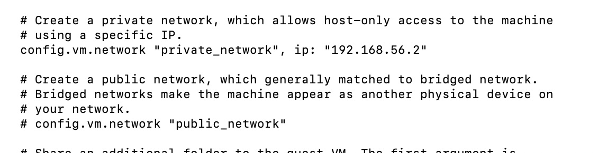
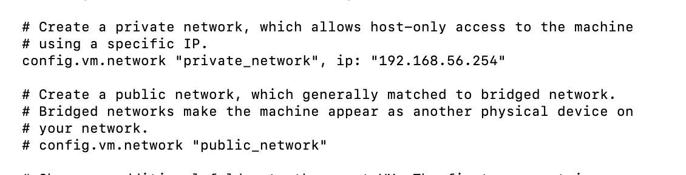
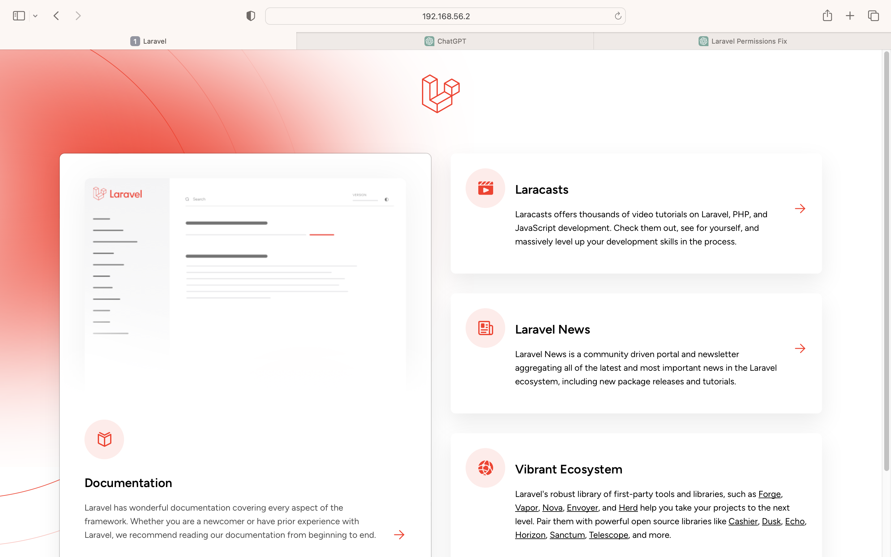
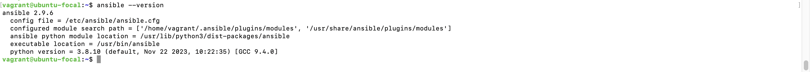
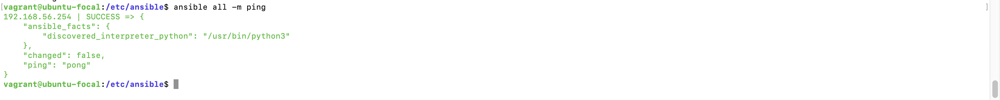

# Automated Provisioning and Deployment with Vagrant and Ansible

This project automates the provisioning of two Ubuntu-based servers using Vagrant and configures them for hosting a PHP application. The servers are named "Master" and "Slave". The Master node sets up a LAMP (Linux, Apache, MySQL, PHP) stack using a bash script, while the Slave node executes this script using an Ansible playbook and verifies the accessibility of the deployed PHP application.

## Prerequisites

Before running this project, ensure you have the following installed:

- [Vagrant](https://www.vagrantup.com/downloads)
- [VirtualBox](https://www.virtualbox.org/wiki/Downloads)
- [Ansible](https://docs.ansible.com/ansible/latest/installation_guide/intro_installation.html) (for executing the playbook)

## Steps Followed:

1. I provisioned two ubuntu machines using vagrant with virtual box and i assigned ip addresses to each machine, as shown below in a screenshot of their respecttive Vagranttfiles:

2. I created a bash script to automate the deployment of a lamp stack on the master and made all necessary configurattions on datbase, php and the apache2 webservers. and i could access the web page on the ip of the master.

3. I then installed ansible on the master tto enable me configure the slave
   

4. Use ansible adhoc commands to ping the slave
   

5. setup playbook and ran the playbook
   [Link to the playbook](URL)

